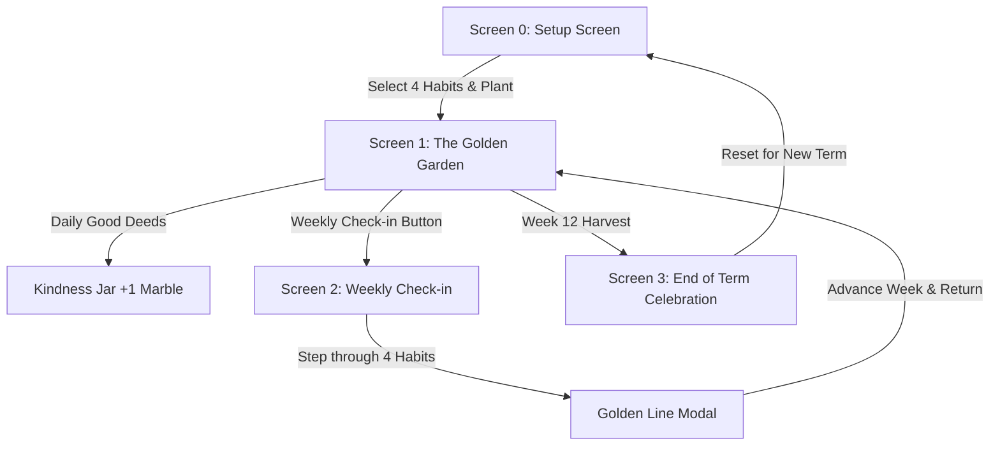

# Unit 10 Specification: Senior Etiquette -- Etiquette for Golden Life ("The Golden Garden")

### 1. Overview & Pedagogical Objective
* **Unit Title**: Etiquette for Golden Life (The Golden Garden)
* **Target Audience**: Class 3 & 4 (Ages 8 to 9)
* **Type**: Teacher-Led Living Class Board & Continuous Etiquette Tracker
* **Session Length**: 2-minute weekly check-in routine + daily Kindness Jar check-in
* **Pedagogical Philosophy**:
  1. **Zero Individual Tracking**: Whole-class progress only; no student is ever singled out or put on the spot.
  2. **Positive Reinforcement**: Neglected habits stay as small green sprouts; plants only grow forward with practice and never wilt or die.
  3. **The Three Es**: Energy, Empathy, and Excellence.

---

### 2. The 8 Golden Habits (Select 4 per Term)
The class selects 4 focus habits at the beginning of each 12-week term:

| # | Habit | Key | Plant Visual | Class Quote / Guidance |
|---|---|---|---|---|
| 1 | **Drink Water** | `Water` | Dewdrop Lily | *"Drink your water -- inside and outside."* |
| 2 | **Sleep Early** | `Sleep` | Night Lavender | *"Sleep early, wake up fresh and ready."* |
| 3 | **Play Outside** | `Outside` | Sun Blossom | *"Play outside -- run under the open sky."* |
| 4 | **Read a Book** | `Read` | Wise Orchid | *"Read a book -- every page holds a wonder."* |
| 5 | **Sit Quietly** | `Quiet` | Peace Lotus | *"Sit quietly for ten minutes. Listen to the calm."* |
| 6 | **Walk and Smile** | `Walk` | Morning Glory | *"Walk with good posture, and greet others with a smile."* |
| 7 | **Give with Heart** | `Give` | Heart Bloom | *"Give something to somebody with a happy heart."* |
| 8 | **Family Time** | `Family` | Tree of Life | *"Spend time with your family every single day."* |

---

### 3. Screen Structure & Flow

#### Screen 0: Setup Screen (`U10_SetupScreen_Masters_Activity.cs`)
* Displayed once at term beginning.
* 8 habit cards in a 2x4 grid with icons and bold guidance quotes.
* Select exactly 4 habits.
* Clicking **"Plant Our Garden"** initializes the 4 pots and persists save data to `U10_SaveData`.

#### Screen 1: The Golden Garden (`U10_GardenScreen_Masters_Activity.cs`)
* **Header**: "The Golden Garden", "Week X of 12", Class Name.
* **4 Terracotta Pots**: Displays the 4 chosen plants evolving across 6 growth stages.
* **Kindness Jar**: Right-hand mason jar with dynamic marble count (0 to 50+). Tap **"Add Kindness Marble"** on observed good deeds.
* **Navigation Bar**:
  * `Weekly Check (2 Min)`: Launches the 2-minute class routine.
  * `Golden Quote`: Displays this week's quote modal.
  * `Teacher Menu`: Centered popup overlay modal with **"Advance to Next Week"**, **"Reset for New Term"**, and **"Close Menu"**.
  * `Harvest Celebration`: Activates at Week 12.

#### Screen 2: Weekly Check-In Screen (`U10_WeeklyCheckScreen_Masters_Activity.cs`)
* 4-step interactive routine:
  1. Teacher reads habit question (e.g. *"Who drank fresh water every day this week?"*).
  2. Ask for show of hands.
  3. Tap **"Yes, We Practiced!"** to advance growth stage and play chime.
  4. Tap **"Next Habit"** to move to the next habit.
  5. After the 4th habit, pops up the Golden Line Modal with the week's inspirational quote.

#### Screen 3: End of Term Harvest Screen (`U10_EndTermScreen_Masters_Activity.cs`)
* Week 12 harvest celebration:
  * Golden Certificate awarding mastery of **The Three Es: Energy, Empathy, and Excellence**.
  * Summary tally of weeks completed, kindness marbles collected, and golden blooms harvested.

---

### 4. Golden Lines of the Week (12-Week Rotation)
1. **Week 1**: *"The Golden Life begins with the simple things you do every day."*
2. **Week 2**: *"Drink your water -- inside and outside."*
3. **Week 3**: *"Sleep early, rise strong and joyful."*
4. **Week 4**: *"Play outside -- the world is wide and green."*
5. **Week 5**: *"A good book is a doorway to a thousand adventures."*
6. **Week 6**: *"Sit quietly for ten minutes. Listen to the calm world."*
7. **Week 7**: *"Walk with confidence, and greet others with a smile."*
8. **Week 8**: *"Giving from the heart makes both people glow."*
9. **Week 9**: *"Family time is the warmest sunshine of life."*
10. **Week 10**: *"Every small good habit grows into a giant strong tree."*
11. **Week 11**: *"Every act of kindness is a shining marble in your jar."*
12. **Week 12**: *"The Three Es of Golden Life: Energy, Empathy, Excellence!"*
