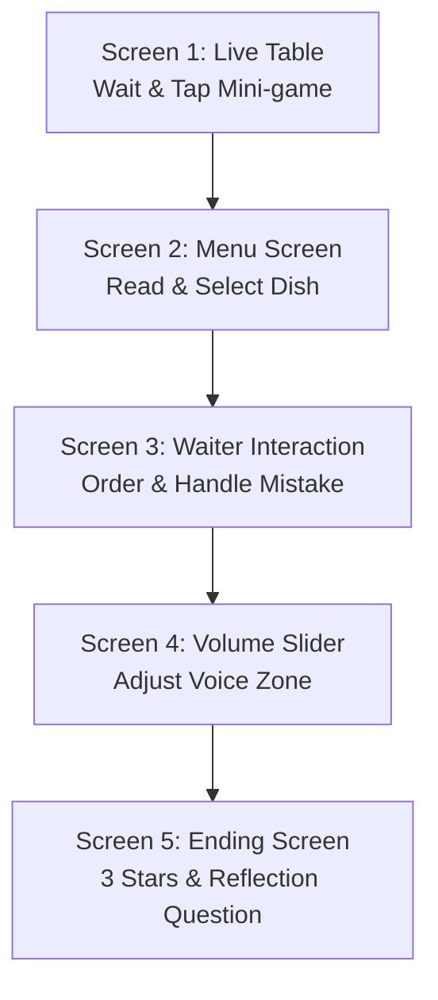

# Senior Etiquette — Unit 6: Table Etiquette & Eating Out

**Target Audience:** Class 3 & Class 4 (Ages 8–9)  
**Platform:** Unity 2D (Smartboard & Touch Optimized)  
**Curriculum Focus:** Restaurant manners, patience while waiting, polite ordering, volume modulation  
**Scene Location:** `Assets/SeniorsActivityUnit6/Scenes/SeniorsActivity_unit6.unity`  

---

## 🎯 Educational Goals

1. **Patience While Waiting:** Managing fidgeting or tapping cutlery while waiting for food to arrive.
2. **Reading Before Ordering:** Looking at the menu before calling the waiter.
3. **Polite Requesting:** Using polite forms (*"Could I have the dosa, please?"*) rather than demanding.
4. **Handling Mistakes Calmly:** When the wrong dish arrives, politely bringing it to the waiter's attention rather than throwing a tantrum.
5. **Indoor Voice Volume:** Adjusting vocal loudness to match a shared restaurant setting.

---

## 🎮 Screen Architecture & Flow



### Detailed Screen Controllers

| Screen | Controller Script | Key Actions & Sound Cues |
| :--- | :--- | :--- |
| **Screen 1: Live Table** | [`U6_LiveTableScreen_Masters_Activity.cs`](file:///c:/Users/abhir/SR_InterProjects/Repos/MastersActivity-Unit-6/Assets/SeniorsActivityUnit6/Scripts/Screens/U6_LiveTableScreen_Masters_Activity.cs) | Waiting timer, tap reaction button, fidget animation, `AMB_Restaurant`, `SFX_GlassTing`, `SFX_ChairWobble`, Star 1 award. |
| **Screen 2: Menu Screen** | [`U6_MenuScreen_Masters_Activity.cs`](file:///c:/Users/abhir/SR_InterProjects/Repos/MastersActivity-Unit-6/Assets/SeniorsActivityUnit6/Scripts/Screens/U6_MenuScreen_Masters_Activity.cs) | Open laminated menu (`SFX_MenuOpen`), food item preview, dish selection (`VO_U6_05`, `VO_U6_06`). |
| **Screen 3: Waiter Interaction** | [`U6_WaiterInteractionScreen_Masters_Activity.cs`](file:///c:/Users/abhir/SR_InterProjects/Repos/MastersActivity-Unit-6/Assets/SeniorsActivityUnit6/Scripts/Screens/U6_WaiterInteractionScreen_Masters_Activity.cs) | Ravi approaches (`VO_U6_08`), ordering choice, wrong dish delivered (`SFX_PlateDown`, `VO_U6_09`), reaction choice (Polite vs Rude), Star 2 award. |
| **Screen 4: Volume Slider** | [`U6_SliderScreen_Masters_Activity.cs`](file:///c:/Users/abhir/SR_InterProjects/Repos/MastersActivity-Unit-6/Assets/SeniorsActivityUnit6/Scripts/Screens/U6_SliderScreen_Masters_Activity.cs) | 3-zone voice slider (Too Quiet, Just Right, Too Loud), parent feedback (`VO_U6_DAD_1`, `VO_U6_MUM_1`), Star 3 award. |
| **Screen 5: Ending Celebration** | [`U6_EndingScreen_Masters_Activity.cs`](file:///c:/Users/abhir/SR_InterProjects/Repos/MastersActivity-Unit-6/Assets/SeniorsActivityUnit6/Scripts/Screens/U6_EndingScreen_Masters_Activity.cs) | 3 Gold Stars burst (`SFX_Star`), Confetti (`SFX_Confetti`), Victory Fanfare (`MUS_Win`), Discussion Prompt (`VO_U6_13`). |

---

## 📁 Directory Structure

```text
Assets/SeniorsActivityUnit6/
├── Art/
│   ├── UI and background textures
│   └── Character and prop sprites
├── Audio/
│   └── U6_MastersActivity_audios/     # 51 standardized audio clips
│       ├── VO_U6_01.mp3 to VO_U6_13.mp3
│       ├── VO_U6_ANU_1.mp3 to VO_U6_ANU_10.mp3
│       ├── VO_U6_WAIT_1.mp3 to VO_U6_WAIT_4.mp3
│       ├── VO_U6_DAD_1.mp3, VO_U6_MUM_1.mp3
│       ├── AMB_Restaurant.mp3, AMB_RestaurantHush.mp3
│       ├── MUS_Restaurant.mp3, MUS_Win.mp3
│       └── SFX_*.mp3
├── Scenes/
│   └── SeniorsActivity_unit6.unity
├── Scripts/
│   ├── Core/
│   │   ├── U6_GameManager_Masters_Activity.cs
│   │   ├── U6_AudioManager_Masters_Activity.cs
│   │   └── U6_Enums_Masters_Activity.cs
│   ├── Screens/
│   │   ├── U6_LiveTableScreen_Masters_Activity.cs
│   │   ├── U6_MenuScreen_Masters_Activity.cs
│   │   ├── U6_WaiterInteractionScreen_Masters_Activity.cs
│   │   ├── U6_SliderScreen_Masters_Activity.cs
│   │   └── U6_EndingScreen_Masters_Activity.cs
│   ├── UI/
│   └── Editor/
└── SFX/
```

---

## 🔊 Audio System Reference

Audio playback is managed by [`U6_AudioManager_Masters_Activity.cs`](file:///c:/Users/abhir/SR_InterProjects/Repos/MastersActivity-Unit-6/Assets/SeniorsActivityUnit6/Scripts/Core/U6_AudioManager_Masters_Activity.cs).

### Key API Methods
- `U6_AudioManager_Masters_Activity.Instance.PlayVO("VO_U6_01");`
- `U6_AudioManager_Masters_Activity.Instance.PlaySFX("SFX_MenuOpen");`
- `U6_AudioManager_Masters_Activity.Instance.PlayAmbience("AMB_Restaurant");`
- `U6_AudioManager_Masters_Activity.Instance.PlayBGM("MUS_Restaurant");`

### Built-in Aliases
The audio manager automatically maps legacy alias calls to standardized audio clips:
- `"MUS_Loop"` $\leftrightarrow$ `"MUS_Restaurant"`
- `"SFX_DoorBell"` $\leftrightarrow$ `"SFX_DoorChime"`
- `"SFX_SliderZone"` $\leftrightarrow$ `"SFX_Bubble"`
