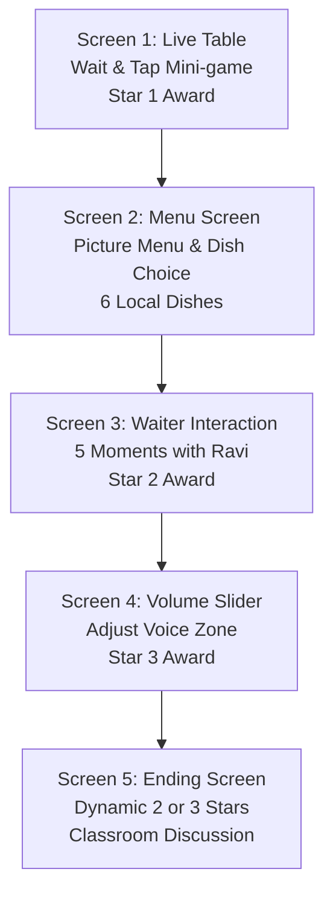

# Senior Etiquette — Unit 6: Table Etiquette & Eating Out

**Target Audience:** Class 3 & Class 4 (Ages 8–9)  
**Platform:** Unity 2D (Smartboard, Tablet & Touch Optimized, Android APK Certified)  
**Curriculum Focus:** Restaurant manners, patience while waiting, polite ordering, handling food mistakes calmly, indoor voice modulation  
**Scene Location:** [`Assets/SeniorsActivityUnit6/Scenes/SeniorsActivity_unit6.unity`](file:///c:/Users/abhir/SR_InterProjects/Repos/MastersActivity-Unit-6/Assets/SeniorsActivityUnit6/Scenes/SeniorsActivity_unit6.unity)  

---

## 🌟 Overview & Educational Objectives

Unit 6 teaches children how to behave in public dining environments, differentiating home manners from restaurant etiquette:
1. **Patience While Waiting:** Managing fidgeting, sliding off chairs, or tapping cutlery while waiting for food to arrive.
2. **Reading Before Ordering:** Reading the menu before calling the waiter (`VO_U6_06`: *"Read first"*).
3. **Polite Requesting:** Using polite forms (*"Could I have the dosa, please?"*) rather than blunt demands.
4. **Handling Mistakes Calmly:** When the wrong dish arrives, politely addressing the waiter (*"Sorry, I think I ordered..."*) rather than shouting.
5. **Table Hand-Raising:** Gently raising a hand at the family table to politely get the waiter's attention.
6. **Indoor Voice Volume:** Modulating vocal volume using a 3-zone slider to fit a shared dining room.
7. **Consideration for Others:** Leaving promptly when finished so waiting families can be seated.

---

## 🎮 Complete Screen Flow & Architecture


```mermaid
graph TD
    A[Screen 1: Live Table<br/>Wait & Tap Mini-game<br/>Star 1 Award] --> B[Screen 2: Menu Screen<br/>Picture Menu & Dish Choice<br/>6 Local Dishes]
    B --> C[Screen 3: Waiter Interaction<br/>5 Moments with Ravi<br/>Star 2 Award]
    C --> D[Screen 4: Volume Slider<br/>Adjust Voice Zone<br/>Star 3 Award]
    D --> E[Screen 5: Ending Screen<br/>Dynamic 2 or 3 Stars<br/>Classroom Discussion]
```

### 1. Screen 1: Live Table (`U6_LiveTableScreen_Masters_Activity.cs`)
* **Concept:** Anu waits for food with her family. Impatience causes her to fidget.
* **Mechanic:** The player taps reaction buttons (`STAY SEATED`, `PUT IT DOWN`, `WAIT QUIETLY`, `FEET ON FLOOR`) before timer expires.
* **Feedback:** When Anu fidgets, background diner tables turn around and stare.
* **Rewards:** Earning Star 1 upon successful waiting.
* **Audio Cues:** `AMB_Restaurant`, `SFX_GlassTing`, `SFX_ChairWobble`, `VO_U6_01` to `VO_U6_04`.

### 2. Screen 2: The Menu (`U6_MenuScreen_Masters_Activity.cs`)
* **Concept:** Looking at the menu before calling the waiter.
* **Curated Dishes:** 6 Indian restaurant dishes:
  1. **Dosa** (₹60)
  2. **Idli** (₹40)
  3. **Noodles** (₹80)
  4. **Rice** (₹70)
  5. **Roti** (₹50)
  6. **Ice Cream** (₹45)
* **Mechanic:** 
  * If the player calls the waiter before selecting a dish, Waiter Ravi arrives and Anu stammers (*"Ummm... ummm..."*), prompting *"Read first."*
  * Once a dish is selected, choice cards appear with **Polite** (*"Could I have the [Dish], please?"*) vs **Blunt** (*"I want [Dish]!"*).
* **Audio Cues:** Dedicated polite and blunt audio clips for all 6 dishes (`VO_U6_ORD_*_POLITE`, `VO_U6_ORD_*_BLUNT`), `SFX_MenuOpen`, `SFX_PadWrite`, `VO_U6_WAIT_1`.

### 3. Screen 3: Waiter Interaction (`U6_WaiterInteractionScreen_Masters_Activity.cs`)
* **Concept:** Five distinct interactive moments with Waiter Ravi:
  1. **Water Served:** Ravi brings water. Choice: *"Thank you!"* vs *(Say nothing)*. Water glasses dynamically fill with celebratory bubble bounce.
  2. **Calling Ravi:** Anu needs the waiter from across the room. Choice: *"Raise a hand gently and make eye contact"* vs shouting.
  3. **Wrong Dish:** Ravi mistakenly brings the wrong dish. Anu dynamically says: *"Sorry, I think I ordered [Selected Dish]!"* Choice: Polite gently vs *"This is WRONG!"*. Ravi warms up and apologizes: *"Oh! My apologies, I will bring your food right away!"* (`VO_U6_WAIT_3`).
  4. **Food Served:** Hot ordered dish arrives. Choice: *"Thank you, Ravi!"* vs grabbing food immediately.
  5. **Dropped Fork:** Fork drops on the floor. Choice: *"Excuse me, could I have another fork please?"* vs shouting.
* **Family Table Hand-Raising Behavior:**
  * In all asking moments (**Moments 1, 2, and 4**), the main stage table visual automatically displays **Anu raising her hand with her family** (`U6_MAct_Family_HandRaise`) while speaking.
  * Transitions smoothly back to sitting straight (`U6_MAct_Family_SittingStraight`) once Ravi responds or apologizes.
* **Dynamic Audio Synchronization:** Non-blocking dynamic delay (`wrongClip.length + 0.45f`) guarantees Anu finishes speaking her entire sentence before Ravi speaks.

### 4. Screen 4: Voice Volume Slider (`U6_SliderScreen_Masters_Activity.cs`)
* **Concept:** Modulating voice volume in public settings.
* **Dialogue:** Anu practices calling the waiter: *"Excuse me, Ravi!"*
* **3 Interactive Zones:**
  * **Whisper (Too Quiet):** Quiet whisper. Dad leans across: *"Sorry? I cannot hear you at all."* (`VO_U6_DAD_1`).
  * **Just Right (Normal):** Clear indoor voice. Ravi responds calmly. Star 3 awarded!
  * **Big Voice (Too Loud):** Loud shout. Mum warns gently: *"Anu, indoor voice, please."* (`VO_U6_MUM_2`). Nearby baby cries (`SFX_BabyCry`).
* **Table Turnover:** When leaving politely, Anu's family leaves and the waiting family at the door gets a table.

### 5. Screen 5: Ending Screen (`U6_EndingScreen_Masters_Activity.cs`)
* **Concept:** Celebration and classroom discussion prompt: *"What will you say to the waiter next time?"* (`VO_U6_13`).
* **Dynamic Star Scoring:**
  * **3 Stars Earned:** Full victory fanfare (`MUS_Win`), confetti burst (`SFX_Confetti`), and 3 golden stars (`SFX_Star`).
  * **2 Stars Earned:** Displays dynamic banner `"2 Stars Earned!"` with encouraging voiceover (`VO_U6_12_2STARS`).

---

## 📁 Directory Structure

```text
Assets/SeniorsActivityUnit6/
├── Art/
│   └── U6_MastersActivitySprites/
│       ├── U6_seniorsActivityBook.png               # Main family table (SittingStraight, HandRaise, Fidgets)
│       ├── U6 MA Anu (Main Child)...Sprite Sheet.png # Single Anu reaction portraits
│       ├── U6 MA Picture Menu Dishes.png            # 6 Indian food items
│       ├── u6 MA more waiter ravi sprites.png       # 10 full-body Waiter Ravi poses
│       └── U6 MA Restaurant Interior.png            # Full-bleed restaurant background
├── Audio/
│   └── U6_MastersActivity_audios/                   # Standardized clips (VO_*, SFX_*, AMB_*, MUS_*)
│       ├── VO_U6_01.mp3 to VO_U6_13.mp3             # Narrator dialogue lines
│       ├── VO_U6_ANU_1.mp3 to VO_U6_ANU_10.mp3      # Anu voice lines
│       ├── VO_U6_ORD_*_POLITE / BLUNT.mp3           # 12 Dish order clips
│       ├── VO_U6_ANU_WRONG_*.mp3                    # 6 Dynamic wrong dish lines
│       ├── VO_U6_SLIDER_*.mp3                       # Volume slider voice variations
│       └── SFX_*.wav / mp3                          # Sound effects (glasses, plates, cutlery, sparkles)
├── Scenes/
│   └── SeniorsActivity_unit6.unity                  # Main playable Unity scene
├── Scripts/
│   ├── Core/                                        # U6_GameManager, U6_AudioManager, U6_Enums
│   ├── Screens/                                     # 5 Screen Controllers
│   ├── UI/                                          # Reusable UI widgets & safe area constraint
│   └── Editor/                                      # Automation tools & setup scripts
└── SFX/                                             # 16-bit PCM WAV sound effects
```

---

## 🛠️ Inspector Configuration & APK Build Readiness

> [!IMPORTANT]
> **Android APK Build Rule:** In standalone builds, Unity completely disables `AssetDatabase.LoadAssetAtPath`. All sprites and audio clips must be directly serialized in scene fields.

### Key Inspector Fields on `MenuScreen`
* **Default Dishes (6 Elements):**
  * `Dosa`: `politeOrderClip` $\rightarrow$ `VO_U6_ORD_DOSA_POLITE`, `impoliteOrderClip` $\rightarrow$ `VO_U6_ORD_DOSA_BLUNT`
  * `Idli`: `politeOrderClip` $\rightarrow$ `VO_U6_ORD_IDLI_POLITE`, `impoliteOrderClip` $\rightarrow$ `VO_U6_ORD_IDLI_BLUNT`
  * `Noodles`: `politeOrderClip` $\rightarrow$ `VO_U6_ORD_NOODLES_POLITE`, `impoliteOrderClip` $\rightarrow$ `VO_U6_ORD_NOODLES_BLUNT`
  * `Rice`: `politeOrderClip` $\rightarrow$ `VO_U6_ORD_RICE_POLITE`, `impoliteOrderClip` $\rightarrow$ `VO_U6_ORD_RICE_BLUNT`
  * `Roti`: `politeOrderClip` $\rightarrow$ `VO_U6_ORD_ROTI_POLITE`, `impoliteOrderClip` $\rightarrow$ `VO_U6_ORD_ROTI_BLUNT`
  * `Ice Cream`: `politeOrderClip` $\rightarrow$ `VO_U6_ORD_ICECREAM_POLITE`, `impoliteOrderClip` $\rightarrow$ `VO_U6_ORD_ICECREAM_BLUNT`

### Key Inspector Fields on `WaiterInteractionScreen`
* **Family Dining Table Sprites:**
  * `Family Table Calm Sprite`: `U6_MAct_Family_SittingStraight` (from `U6_seniorsActivityBook.png`)
  * `Family Table Hand Raise Sprite`: `U6_MAct_Family_HandRaise` (from `U6_seniorsActivityBook.png`)
  * `Family Table React Sprite`: `U6_MAct_Family_ShoutingHungry` (from `U6_seniorsActivityBook.png`)
* **Moments Configuration:**
  * `Element 0 (Water)`: `Option B` set to empty / silent (no *"Ummm... ummm..."*).
  * `Element 1 (Calling Ravi)`: `Anu Reaction Sprite` $\rightarrow$ `U6_MAct_Family_HandRaise`.
  * `Element 2 (Wrong Dish)`: Auto-plays dynamic ordered dish clip and shows hand raise.
  * `Element 4 (Dropped Fork)`: Shows hand raise while requesting new fork.
