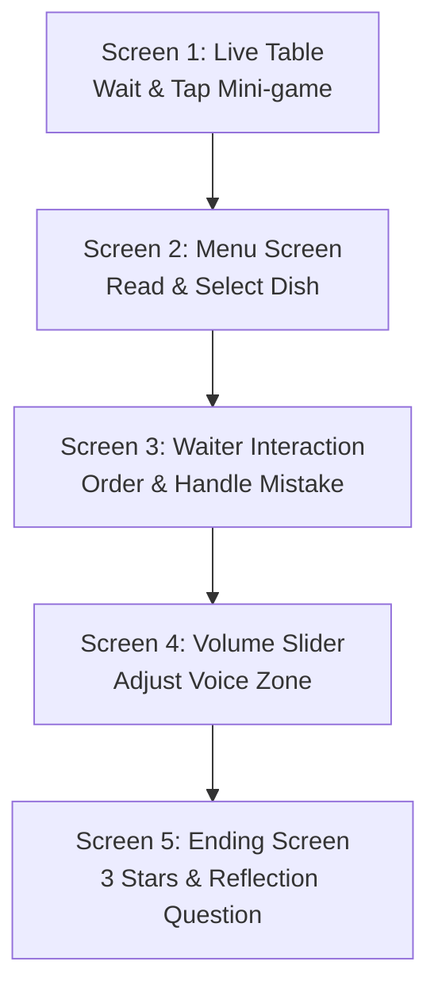

# Senior Etiquette — Unit 6: Table Etiquette & Eating Out

**Target Audience:** Class 3 & Class 4 (Ages 8–9)  
**Platform:** Unity 2D (Smartboard & Touch Optimized)  
**Curriculum Focus:** Restaurant manners, patience while waiting, polite ordering, volume modulation  
**Scene Location:** `Assets/SeniorsActivityUnit6/Scenes/SeniorsActivity_unit6.unity`  

---

## 📐 Core Architectural Rules

> **1. Every visual object has a deliberate pivot.**  
> - Seated & standing characters (`Anu`, `Waiter Ravi`, `Waiting Family`): `pivot = (0.5, 0)` at floor/seat contact plane.  
> - Tabletop props (jug, plates, fork, cutlery): `pivot = (0.5, 0)` resting on table surface.  
> - Top banners, headers, and situation prompts: `pivot = (0.5, 1)` pinned to top.  
> - Bottom action bars, buttons, and feedback trays: `pivot = (0.5, 0)` pinned to bottom.  
> - Interactive buttons, cards, stars, and slider knobs: `pivot = (0.5, 0.5)` for uniform scale/pop animations.  
>  
> **2. Every UI object has deliberate anchors.**  
> - Headers & Prompts: Pinned to Top-Center (`anchorMin = anchorMax = (0.5, 1)`) with negative Y offsets from top edge.  
> - Action Buttons & Feedback: Pinned to Bottom-Center (`anchorMin = anchorMax = (0.5, 0)`) with positive Y offsets from bottom edge.  
> - Stage Characters & Props: Proportional stage baselines (`(0.24, 0.28)`, `(0.5, 0.28)`, `(0.74, 0.18)`).  
> - Text labels & card sub-elements: Stretched (`anchorMin = Vector2.zero, anchorMax = Vector2.one`) with deliberate internal padding.  
>  
> **3. Every interactive object has a safe-area constraint.**  
> - All interactive elements reside inside a dedicated `SafeArea` container managed by [`U6_SafeAreaConstraint.cs`](file:///c:/Users/abhir/SR_InterProjects/Repos/MastersActivity-Unit-6/Assets/SeniorsActivityUnit6/Scripts/UI/U6_SafeAreaConstraint.cs).  
> - Automatically conforms to `Screen.safeArea` at runtime (notches, camera cutouts, home bars).  
> - Strictly preserves Host Game Navigation Clearance for Top-Left and Bottom-Left universal buttons.  
>  
> **4. Nothing important is positioned purely by screen coordinates.**  
> - Zero hardcoded center-screen absolute pixel math. All positions are relative to docked edges, proportional zones, or layout containers.

---

## 🚀 Quick Setup in Unity Editor

1. Open the Unity Project (`Unity 2022.3.62f3`).
2. In the top Unity menu, click:  
   **`Googolplex` > `Unit 6` > `Generate Complete Scene Hierarchy`**  
   *(or use **`Unit 6` > `Generate and Assign All Assets & Hierarchy`**)*.
3. The automated scene generator will:
   - Configure CanvasScaler to `1920x1080` (`matchWidthOrHeight = 0.5`).
   - Create the full-bleed restaurant background.
   - Build each screen (`LiveTableScreen`, `MenuScreen`, `ChoiceScreen`, `SliderScreen`, `EndingScreen`) with dedicated `SafeArea` containers and [`U6_SafeAreaConstraint`](file:///c:/Users/abhir/SR_InterProjects/Repos/MastersActivity-Unit-6/Assets/SeniorsActivityUnit6/Scripts/UI/U6_SafeAreaConstraint.cs).
   - Apply deliberate pivots, deliberate anchors, and high-contrast typography.
   - Wire all references to `[GameManager]` and `U6_AudioManager`.
   - Save the ready-to-run scene at `Assets/SeniorsActivityUnit6/Scenes/SeniorsActivity_unit6.unity`.
4. Press **Play** in Unity to run the activity!

---

## 🎯 Educational Goals

1. **Patience While Waiting:** Managing fidgeting or tapping cutlery while waiting for food to arrive.
2. **Reading Before Ordering:** Looking at the menu before calling the waiter.
3. **Polite Requesting:** Using polite forms (*"Could I have the dosa, please?"*) rather than demanding.
4. **Handling Mistakes Calmly:** When the wrong dish arrives, politely bringing it to the waiter's attention rather than throwing a tantrum.
5. **Indoor Voice Volume:** Adjusting vocal loudness to match a shared restaurant setting.

---

## 🎮 Screen Architecture & Flow


```mermaid
graph TD
    A[Screen 1: Live Table<br/>Wait & Tap Mini-game] --> B[Screen 2: Menu Screen<br/>Read & Select Dish]
    B --> C[Screen 3: Waiter Interaction<br/>Order & Handle Mistake]
    C --> D[Screen 4: Volume Slider<br/>Adjust Voice Zone]
    D --> E[Screen 5: Ending Screen<br/>3 Stars & Reflection Question]
```

### Detailed Screen Controllers

| Screen | Controller Script | Key Actions & Sound Cues |
| :--- | :--- | :--- |
| **Screen 1: Live Table** | [`U6_LiveTableScreen_Masters_Activity.cs`](file:///c:/Users/abhir/SR_InterProjects/Repos/MastersActivity-Unit-6/Assets/SeniorsActivityUnit6/Scripts/Screens/U6_LiveTableScreen_Masters_Activity.cs) | Waiting timer, tap reaction button, fidget animation, `AMB_Restaurant`, `SFX_GlassTing`, `SFX_ChairWobble`, Star 1 award. |
| **Screen 2: Menu Screen** | [`U6_MenuScreen_Masters_Activity.cs`](file:///c:/Users/abhir/SR_InterProjects/Repos/MastersActivity-Unit-6/Assets/SeniorsActivityUnit6/Scripts/Screens/U6_MenuScreen_Masters_Activity.cs) | Open laminated menu (`SFX_MenuOpen`), food item preview, dish selection (`VO_U6_05`, `VO_U6_06`). |
| **Screen 3: Waiter Interaction** | [`U6_WaiterInteractionScreen_Masters_Activity.cs`](file:///c:/Users/abhir/SR_InterProjects/Repos/MastersActivity-Unit-6/Assets/SeniorsActivityUnit6/Scripts/Screens/U6_WaiterInteractionScreen_Masters_Activity.cs) | Ravi approaches (`VO_U6_08`), ordering choice, wrong dish delivered (`SFX_PlateDown`, `VO_U6_09`), reaction choice (Polite vs Rude), Star 2 award. |
| **Screen 4: Volume Slider** | [`U6_SliderScreen_Masters_Activity.cs`](file:///c:/Users/abhir/SR_InterProjects/Repos/MastersActivity-Unit-6/Assets/SeniorsActivityUnit6/Scripts/Screens/U6_SliderScreen_Masters_Activity.cs) | 3-zone voice slider (Too Quiet, Just Right, Too Loud), parent feedback (`VO_U6_DAD_1`, `VO_U6_MUM_1`), Star 3 award. |
| **Screen 5: Ending Celebration** | [`U6_EndingScreen_Masters_Activity.cs`](file:///c:/Users/abhir/SR_InterProjects/Repos/MastersActivity-Unit-6/Assets/SeniorsActivityUnit6/Scripts/Screens/U6_EndingScreen_Masters_Activity.cs) | 3 Gold Stars burst (`SFX_Star`), Confetti (`SFX_Confetti`), Victory Fanfare (`MUS_Win`), Discussion Prompt (`VO_U6_13`). |

---

## 📁 Directory Structure

```text
Assets/SeniorsActivityUnit6/
├── Art/
│   ├── UI and background textures
│   └── Character and prop sprites
├── Audio/
│   └── U6_MastersActivity_audios/     # 51 standardized audio clips
│       ├── VO_U6_01.mp3 to VO_U6_13.mp3
│       ├── VO_U6_ANU_1.mp3 to VO_U6_ANU_10.mp3
│       ├── VO_U6_WAIT_1.mp3 to VO_U6_WAIT_4.mp3
│       ├── VO_U6_DAD_1.mp3, VO_U6_MUM_1.mp3
│       ├── AMB_Restaurant.mp3, AMB_RestaurantHush.mp3
│       ├── MUS_Restaurant.mp3, MUS_Win.mp3
│       └── SFX_*.mp3
├── Scenes/
│   └── SeniorsActivity_unit6.unity
├── Scripts/
│   ├── Core/
│   │   ├── U6_GameManager_Masters_Activity.cs
│   │   ├── U6_AudioManager_Masters_Activity.cs
│   │   └── U6_Enums_Masters_Activity.cs
│   ├── Screens/
│   │   ├── U6_LiveTableScreen_Masters_Activity.cs
│   │   ├── U6_MenuScreen_Masters_Activity.cs
│   │   ├── U6_WaiterInteractionScreen_Masters_Activity.cs
│   │   ├── U6_SliderScreen_Masters_Activity.cs
│   │   └── U6_EndingScreen_Masters_Activity.cs
│   ├── UI/
│   └── Editor/
└── SFX/
```

---

## 🔊 Audio System Reference

Audio playback is managed by [`U6_AudioManager_Masters_Activity.cs`](file:///c:/Users/abhir/SR_InterProjects/Repos/MastersActivity-Unit-6/Assets/SeniorsActivityUnit6/Scripts/Core/U6_AudioManager_Masters_Activity.cs).

### Key API Methods
- `U6_AudioManager_Masters_Activity.Instance.PlayVO("VO_U6_01");`
- `U6_AudioManager_Masters_Activity.Instance.PlaySFX("SFX_MenuOpen");`
- `U6_AudioManager_Masters_Activity.Instance.PlayAmbience("AMB_Restaurant");`
- `U6_AudioManager_Masters_Activity.Instance.PlayBGM("MUS_Restaurant");`

### Built-in Aliases
The audio manager automatically maps legacy alias calls to standardized audio clips:
- `"MUS_Loop"` $\leftrightarrow$ `"MUS_Restaurant"`
- `"SFX_DoorBell"` $\leftrightarrow$ `"SFX_DoorChime"`
- `"SFX_SliderZone"` $\leftrightarrow$ `"SFX_Bubble"`
