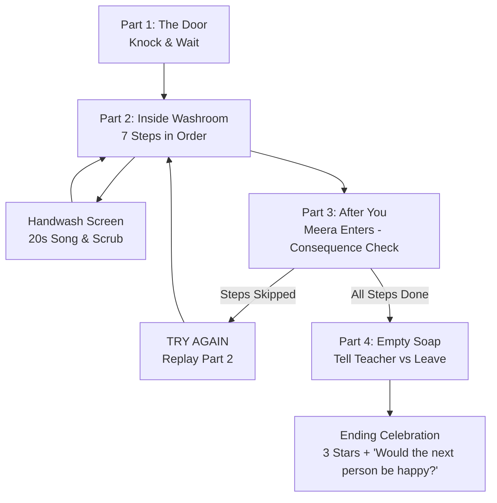

# Senior Etiquette — Unit 8: Washroom Etiquette ("AFTER YOU")

**Target Audience:** Class 3 & Class 4 (Ages 8–9)  
**Platform:** Unity 2D (Smartboard-First / Touch-Optimized)  
**Curriculum Reference:** Book Pages 32–33  
**Activity Duration:** ~12 minutes  
**Reward:** 3 Gold Stars  

---

## 📖 Core Concept: "After You"

> *"Wipe off the sink for the next user."* (Page 33)

The entire unit is built around one core empathy principle: **Everything you do in a shared washroom directly impacts the next person who walks in.** 

Anu uses the washroom first. Thirty seconds later, her friend **Meera** enters. The classroom sees the room *exactly* as Anu left it:
- If Anu was careful $\rightarrow$ The room is clean, dry, and welcoming. Meera uses the washroom happily without hindrance.
- If Anu skipped steps $\rightarrow$ Meera experiences the direct real-world consequences (slips on the wet floor, finds an unflushed cubicle, turns off the running tap, deals with an untidy sink).

---

## 🎮 Game Structure & Screen Flow



---

## 🧩 Overview of Parts

### Part 1 — The Door (`Part1_DoorController`)
- **Setting:** Corridor with a closed washroom door displaying a "SHUT" sign.
- **Choices:**
  1. **Knock and wait (Correct):** 2 polite knocks (`SFX_Knock`), door opens, other student leaves, Anu enters.
  2. **Bang loudly (Incorrect):** 3 loud bangs (`SFX_BangDoor`), muffled voice inside says *"Just a minute!"* (`VO_U8_VOICE_1`), Anu looks sheepish.
  3. **Push it open (Incorrect):** Door is locked, bolt rattles (`SFX_BoltRattle`), teaches that closed doors require patience.

---

### Part 2 — Inside the Washroom (`Part2_WashroomInsideController`)
A side-on view of the washroom: Cubicle (Left), Sink/Tap/Soap (Center), Paper Towel & Bin (Right).

| Step # | Action | Sound Effect | If Skipped Consequence |
| :--- | :--- | :--- | :--- |
| **1 (Required)** | Tap cubicle door to lock | `SFX_BoltClick` | Progression blocked until locked. |
| **2** | Tap Flush | `SFX_Flush` | `isFlushed = false` (Meera finds it unflushed in Part 3). |
| **3** | Tap Anu to come out | Door swing sound | Anu steps to the sink. |
| **4** | Tap Soap/Sink | Transition to **Handwash Screen** | Germ blobs remain on hands. |
| **5** | Turn tap off | `SFX_TapOff` | `isTapTurnedOff = false` (Tap left running). |
| **6** | Towel into bin | `SFX_TowelPull` $\rightarrow$ `SFX_BinDrop` | `isTowelInBin = false` (Soggy towel lands on floor). |
| **7** | Wipe sink | `SFX_Wipe` | `isSinkWiped = false` (Splashes on sink & wet floor). |

---

### Dedicated Screen — The Handwash (`HandwashScreenController`)
- **Visuals:** Close-up of two hands under running water with soap.
- **20-Second Song Sync:** Plays `MUS_HandwashSong` (20 seconds = WHO/CDC recommended handwash duration).
- **Scrubbing Mechanics:** Every tap/swipe triggers `SFX_Scrub`, generates bubbles (`SFX_Bubble`), and increments scrub count.
- **Friendly Germ Blobs:** 4 cute, non-scary, colorful vector characters with small smiling faces. Each few scrubs, one slides off with a playful squeak (`SFX_GermOff`).
- **Pacing Encouragement:** If tapping pauses, prompt displays **"Keep going!"** (`VO_U8_07`).
- **Completion:** Hands sparkle (`SFX_Sparkle`), Star 1 awarded, transitions back to Part 2 to finish towel and sink wiping.

---

### Part 3 — After You (`Part3_AfterYouController`)
- Anu exits $\rightarrow$ 3-second camera pause on the empty washroom $\rightarrow$ Meera enters.
- **Clean State (All steps completed):** Floor is dry, sink is sparkling, tap is off, bin is tidy. Meera uses the sink smoothly and leaves happy. Award Star 2.
- **Messy State (Steps skipped):**
  - **Wet Floor Slip:** Meera's shoe hits the puddle $\rightarrow$ she slides, arms flail, catches herself on the sink (`SFX_Slip`, `VO_U8_MEE_2`).
  - **Splashed Sink:** Unimpressed expression, wipes it before use.
  - **Running Tap:** Reaches over and turns off running tap.
  - **Soggy Towel:** Visible lump on floor next to bin.
  - **Unflushed Toilet:** Opens cubicle, stops, closes door with a grimace.
  - **Action Button:** **"TRY AGAIN"** allows the class to immediately replay Part 2 and get it right!

---

### Part 4 — Empty Soap! (`Part4_EmptySoapController`)
- Meera presses soap dispenser $\rightarrow$ `SFX_SoapPump` $\rightarrow$ nothing comes out $\rightarrow$ `SFX_SoapEmpty`.
- **Choices:**
  1. **Go and tell a teacher (Correct):** Meera informs the teacher (`VO_U8_MEE_1`), dispenser is refilled, sparkles (`SFX_Sparkle`), other students use it happily. Awards Star 3.
  2. **Just leave (Lesson outcome):** Meera shrugs and walks out. Camera holds as 3 more students enter, try in frustration, and leave empty-handed.

---

### Ending Celebration & Discussion
- 3 Gold Stars (`SFX_Star`), Confetti bursts (`SFX_Confetti`), Victory music (`MUS_Win`).
- **Held Discussion Screen:**
  > **"Would the next person be happy?"**
- Connects the lesson to the classroom, playground, dining hall, and school bus.

---

## 🗂️ Project Directory Structure

```
Assets/SeniorsActivityUnit8/
├── doc/
│   ├── Unit_8_Washroom_Etiquette_Class3-4.docx
│   ├── Unit_8_Specification.md
│   └── Audio_Manifest_Unit_8.md
├── README.md
├── Scenes/
│   └── SeniorsActivity_unit8.unity
└── Scripts/
    ├── Core/
    │   ├── U8_GameManager_Masters_Activity.cs
    │   └── U8_AudioManager_Masters_Activity.cs
    ├── Screens/
    │   ├── U8_Part1_DoorController_Masters_Activity.cs
    │   ├── U8_Part2_WashroomInsideController_Masters_Activity.cs
    │   ├── U8_HandwashScreenController_Masters_Activity.cs
    │   ├── U8_Part3_AfterYouController_Masters_Activity.cs
    │   ├── U8_Part4_EmptySoapController_Masters_Activity.cs
    │   └── U8_EndingScreen_Masters_Activity.cs
    └── Editor/
        └── U8_SceneSetupTool_Masters_Activity.cs
```

---

## 🛠️ How to Setup & Run in Unity

1. Open the project in **Unity Editor**.
2. Go to the top menu bar: **`Googolplex` $\rightarrow$ `Unit 8` $\rightarrow$ `Setup Complete Unit 8 Scene`**.
3. The tool automatically creates the Canvas, UI elements, character avatars, audio sources, and wires up all component references.
4. Press **Play** in the Unity Editor to test all 4 parts and the Handwash song loop!
