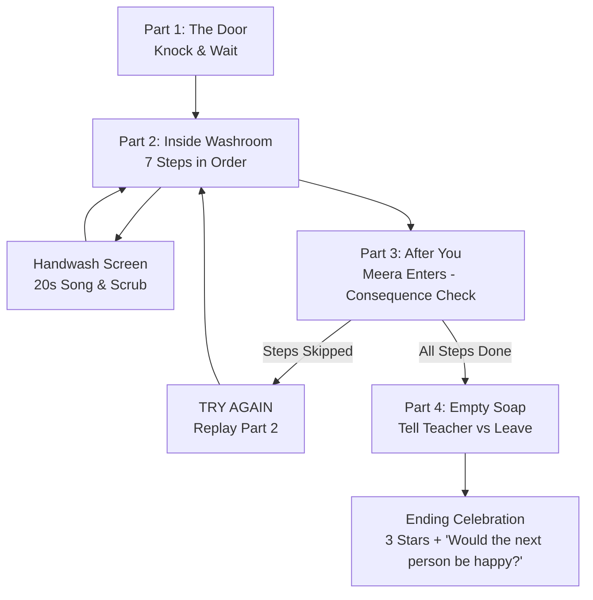

# Senior Etiquette — Unit 8: Washroom Etiquette ("AFTER YOU")

**Target Audience:** Class 3 & Class 4 (Ages 8–9)  
**Platform:** Unity 2D (Smartboard-First / Touch-Optimized)  
**Curriculum Reference:** Book Pages 32–33  
**Activity Duration:** ~12 minutes  
**Reward:** 3 Gold Stars  

---

## 📖 Core Concept: "After You"

> *"Wipe off the sink for the next user."* (Page 33)

The entire unit is built around one core empathy principle: **Everything you do in a shared washroom directly impacts the next person who walks in.** 

Anu uses the washroom first. Thirty seconds later, her friend **Meera** enters. The classroom sees the room *exactly* as Anu left it:
- If Anu was careful $\rightarrow$ The room is clean, dry, and welcoming. Meera uses the washroom happily without hindrance.
- If Anu skipped steps $\rightarrow$ Meera experiences the direct real-world consequences (slips on the wet floor, finds an unflushed cubicle, turns off the running tap, deals with an untidy sink).

---

## 🎮 Game Structure & Screen Flow



---

## 🧩 Overview of Parts

### Part 1 — The Door (`Part1_DoorController`)
- **Setting:** Corridor with a closed washroom door displaying a "SHUT" sign.
- **Choices:**
  1. **Knock and wait (Correct):** 2 polite knocks (`SFX_Knock`), door opens, other student leaves, Anu enters.
  2. **Bang loudly (Incorrect):** 3 loud bangs (`SFX_BangDoor`), muffled voice inside says *"Just a minute!"* (`VO_U8_VOICE_1`), Anu looks sheepish.
  3. **Push it open (Incorrect):** Door is locked, bolt rattles (`SFX_BoltRattle`), teaches that closed doors require patience.

---

### Part 2 — Inside the Washroom (`Part2_WashroomInsideController`)
A side-on view of the washroom: Cubicle (Left), Sink/Tap/Soap (Center), Paper Towel & Bin (Right), with a dedicated step button card.

| Step # | Action | Sound Effect | Visual Feedback & Pacing | If Skipped Consequence |
| :--- | :--- | :--- | :--- | :--- |
| **1 (Required)** | Close & lock cubicle door | `SFX_BoltClick` | Door turns closed, Step 1 button active. | Progression blocked until locked. |
| **2** | Flush the toilet | `SFX_Flush` | Flushes water cleanly. | `isFlushed = false` (Meera finds it unflushed in Part 3). |
| **3** | Step out to the sink | `SFX_DoorOpen` | Cubicle opens, Anu walks to sink. | Anu must step to the sink before washing. |
| **4** | Wash hands (20s) | Transition to **Handwash Screen** | Opens close-up 20s song & scrub screen. | Germ blobs remain on hands. |
| **5** | Turn tap off | `SFX_TapOff` | Water stream turns off, ambience stops. | `isTapTurnedOff = false` (Tap left running). |
| **6** | Towel into bin | `SFX_TowelPull` $\rightarrow$ `SFX_BinDrop` | Parabolic paper towel toss into bin. | `isTowelInBin = false` (Soggy towel lands on floor). |
| **7** | Wipe sink dry | `SFX_Wipe` | Counter sparkles clean, Anu in wiping pose. | `isSinkWiped = false` (Splashes on sink & wet floor). |

#### Intuitive 3-State Step Buttons:
- **Active Step:** Full opacity (`alpha = 1.0`), interactable, with a **punchy pop entry (1.14x)** and gentle continuous breathing pulse animation to immediately guide the student.
- **Completed Steps:** Full visibility with `blocksRaycasts = false` and `interactable = false` so completed steps cannot be re-triggered accidentally.
- **Future Steps:** Full visibility with `blocksRaycasts = false` and `interactable = false`.
- **Dynamic Numerical Resolution:** `FindStepButton(1..7)` automatically binds to scene buttons matching prefixes (`1.`, `2.`, `Btn_1`, etc.) on `OnEnable()` without stale inspector dependencies.

---

### Dedicated Screen — The Handwash (`HandwashScreenController`)
- **Visuals:** Close-up of two hands under running water with soap and bubbles.
- **20-Second Song Sync:** Plays `MUS_HandwashSong` (20 seconds = WHO/CDC recommended handwash duration).
- **8 Friendly Germ Blobs:** Distributed across real handwashing hygiene zones:
  - Fingertips & Nails (Left & Right)
  - Palms (Left & Right)
  - Thumbs (Left & Right)
  - Interdigital Spaces (Between fingers)
  - Wrists (Lower center)
- **Interactive Scrubbing Mechanics:**
  - Every tap/swipe triggers `SFX_Scrub`, pops bubbles (`SFX_Bubble`), and wiggles active germs (`QuickWiggleRoutine`).
  - **Paced Germ Clearance:** Germs clear evenly across the full 20-second duration (~1 germ every 2.5 seconds).
- **Pacing Encouragement:** If tapping pauses for >3s, prompt displays **"Keep going! Scrub the germs away!"** (`VO_U8_07`).
- **Completion:** Hands sparkle (`SFX_Sparkle`), Star 1 awarded (`VO_U8_08`), and automatically returns to Part 2 to continue with Step 5 (Turn Tap Off).

---

### Part 3 — After You (`Part3_AfterYouController`)
- Anu exits $\rightarrow$ 3-second camera pause on the empty washroom $\rightarrow$ Meera enters (`VO_U8_12`).
- **Clean State (All steps completed):** Floor is dry, sink is sparkling, tap is off, bin is tidy. Meera uses the sink smoothly and leaves happy. Award Star 2.
- **Messy State (Steps skipped):**
  - **Wet Floor Slip:** Meera's shoe hits the puddle $\rightarrow$ she slides, arms flail, catches herself on the sink (`SFX_Slip`, `VO_U8_MEE_2`).
  - **Splashed Sink:** Unimpressed expression (`SPR_Meera_Unimpressed`), splashed sink overlay stays visible.
  - **Running Tap:** Water stream remains active until turned off.
  - **Soggy Towel:** Visible lump on floor next to bin.
  - **Unflushed Toilet:** Opens cubicle, stops, closes door with a grimace.
  - **Action Button:** **"TRY AGAIN"** allows the class to immediately replay Part 2 and get it right!

---

### Part 4 — Empty Soap! (`Part4_EmptySoapController`)
- Meera presses soap dispenser $\rightarrow$ `SFX_SoapPump` $\rightarrow$ nothing comes out $\rightarrow$ `SFX_SoapEmpty` (`VO_U8_14`).
- **Choices:**
  1. **Go and tell a teacher (Correct):** Meera informs the teacher (`VO_U8_MEE_1`), dispenser visibly refills (`SPR_Soap_Full`), sparkles (`SFX_Sparkle`), other students use it happily. Awards Star 3.
  2. **Just leave (Lesson outcome):** Meera shrugs and walks out. Camera holds as 3 more students enter, try in frustration, and leave empty-handed.

---

### Ending Celebration & Discussion
- 3 Gold Stars reveal (`SPR_Icon_GoldStar` / `SPR_Star_Gold`, `SFX_Star`), Confetti bursts (`SFX_Confetti`), Victory music (`MUS_Win`, `VO_U8_15`).
- **Held Discussion Screen:**
  > **"Would the next person be happy?"** (`VO_U8_16`)
- Connects the lesson to the classroom, playground, dining hall, and school bus.

---

## 🗂️ Project Directory Structure

```
Assets/SeniorsActivityUnit8/
├── Art/
│   ├── UI_RoundedBox_9Slice.png
│   ├── Hands_washing_with_soap_bubbles_20260921100650.mp4
│   └── more sprites/
│       ├── Character — Anu U8 SA.png (5 poses: Normal, Knocking, Sheepish, Washing, Wiping)
│       ├── Character — Meera U8 SA .png (5 poses: Entering, Slip, Unimpressed, PumpSoap, Happy)
│       ├── Friendly Germs & Handwash Close-Up U8 SA.png (4 Germs, Hands Soapy, Hands Sparkling)
│       ├── Washroom Props & Fixtures U8 SA.png (Doors, Sinks, Tap, Bin, Dispenser)
│       ├── U6 MA Props, Icons & Stars Sprite Sheet.png (Gold & Empty Stars)
│       └── SPR_Washroom_BG.png (Tiled washroom background)
├── doc/
│   ├── Unit_8_Specification.md
│   ├── Audio_Manifest_Unit_8.md
│   ├── CONTEXT.md
│   └── SKILLS.md
├── README.md
├── Scenes/
│   └── SeniorsActivity_unit8.unity
├── SFX/
│   └── generate_sfx.py (Generates all 24 procedural 16-bit PCM WAV SFX files)
└── Scripts/
    ├── Core/
    │   ├── U8_GameManager_Masters_Activity.cs
    │   └── U8_AudioManager_Masters_Activity.cs
    ├── Screens/
    │   ├── U8_Part1_DoorController_Masters_Activity.cs
    │   ├── U8_Part2_WashroomInsideController_Masters_Activity.cs
    │   ├── U8_HandwashScreenController_Masters_Activity.cs
    │   ├── U8_Part3_AfterYouController_Masters_Activity.cs
    │   ├── U8_Part4_EmptySoapController_Masters_Activity.cs
    │   └── U8_EndingScreen_Masters_Activity.cs
    ├── UI/
    │   └── U8_VideoPlayerUI_Masters_Activity.cs
    └── Editor/
        └── U8_SceneSetupTool_Masters_Activity.cs
```

---

## 🛠️ Editor Menu Tools & Workflows

Under **`Googolplex > Unit 8`** in the Unity menu bar:

1. **`Setup Complete Unit 8 Scene`**:
   - Generates the complete 6-screen UI hierarchy, mobile-scaled font typography (32-38pt), rounded 9-slice card backgrounds, and wires all serialized sprites & audio listeners.
2. **`Setup Screen 2 Only (Part 2 Inside)`**:
   - Rebuilds and updates Screen 2 exclusively, preserving custom layouts.
3. **`Setup Screen 3 Only (Handwash Video & Song)`**:
   - Rebuilds Screen 3 with the 8-germ layout and video player setup.
4. **`Setup Screen 4 Only (Part 3 After You)`**:
   - Updates Screen 4 with consequence visuals and Meera slip handling.
5. **`Setup Screen 6 Only (Ending & Stars)`**:
   - Updates Screen 6 with star sprites from sprite sheet.
6. **`Wire Sprites & Audio Only (Non-Destructive)`**:
   - Non-destructively assigns all serialized sprite references and sets up the 4 Main Camera 2D `AudioSource` components without moving or destroying ANY scene GameObjects.
7. **`Clean Duplicate UI Buttons`**:
   - Cleans up any loose duplicate choice buttons in the hierarchy.
8. **`Sanitize All UI Text Glyphs`**:
   - Cleans all TextMeshPro labels in the active scene to plain text without unsupported unicode glyphs.

