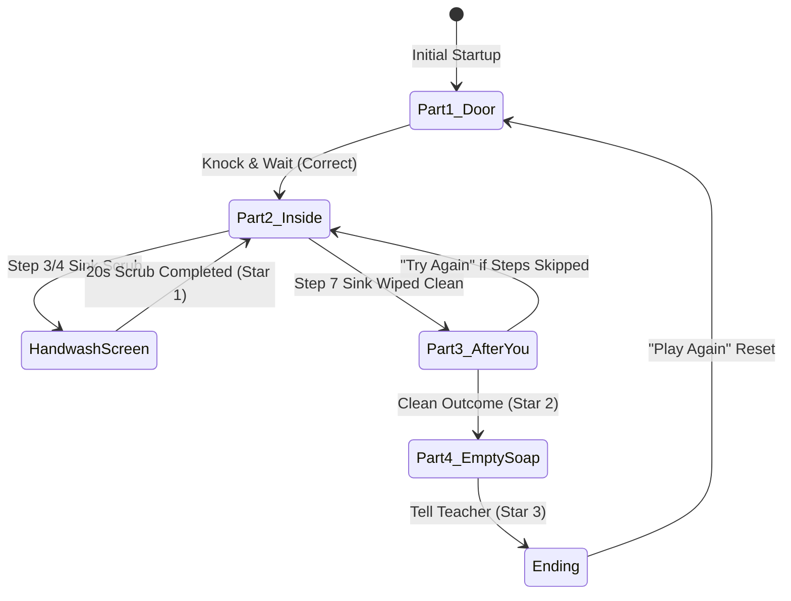

# Unit 8: Washroom Etiquette ("AFTER YOU") — Architecture & Context Document

**Module:** Senior Etiquette (Unit 8)  
**Target Platform:** Unity 2022.3+ LTS (2D UGUI Screen Space Overlay)  
**Resolution Reference:** 1920x1080 (Landscape, Match 0.5)  
**Target Age Group:** Class 3 & 4 (Ages 8–9)

---

## 1. System Architecture & State Machine

The activity is managed by a centralized singleton game manager ([`U8_GameManager_Masters_Activity.cs`](file:///c:/Users/abhir/SR_InterProjects/Repos/MastersActivity-Unit-6/Assets/SeniorsActivityUnit8/Scripts/Core/U8_GameManager_Masters_Activity.cs)) coordinating 6 screen controllers through the enum `U8_GamePart`:

### Game State Flags
- `isCubicleClosedFirst` (bool): Whether the student bolted the cubicle door before using the toilet.
- `isFlushed` (bool): Flush toilet before stepping out.
- `isHandsWashed` (bool): 20-second handwashing completion.
- `isTapTurnedOff` (bool): Prevent running water waste.
- `isTowelInBin` (bool): Prevent wet paper towel on floor.
- `isSinkWiped` (bool): Wipe water splashes off counter.
- `starsEarned` (int): Total stars accumulated (0 to 3).

---

## 2. Audio Engine & Channel Mapping

The audio subsystem ([`U8_AudioManager_Masters_Activity.cs`](file:///c:/Users/abhir/SR_InterProjects/Repos/MastersActivity-Unit-6/Assets/SeniorsActivityUnit8/Scripts/Core/U8_AudioManager_Masters_Activity.cs)) routes all 24 sound effects and voiceovers through 4 dedicated 2D `AudioSource` components hosted directly on the **Main Camera**:

1. **BGM Source (`sources[0]`):** Loopable background music tracks (`MUS_HandwashSong`, `MUS_Win`).
2. **Ambience Source (`sources[1]`):** Environmental room tones (`AMB_Washroom`).
3. **SFX Source (`sources[2]`):** Physics & UI sound effects (`SFX_Knock`, `SFX_BoltClick`, `SFX_Flush`, `SFX_TapOff`, `SFX_Wipe`, `SFX_Slip`, etc.).
4. **Voiceover Source (`sources[3]`):** Character dialogue & pedagogical prompts (`VO_U8_01` through `VO_U8_14`, `VO_U8_MEE_1`, `VO_U8_MEE_2`, `VO_U8_ANU_1`).

---

## 3. Character Sprite Manifest

All 10 character poses are sliced from `Assets/SeniorsActivityUnit8/Art/more sprites/`:

### Anu (First User)
- **`SPR_Anu_Normal`**: Idle / listening pose in corridor and cubicle.
- **`SPR_Anu_Knocking`**: Arm raised knocking when polite manners are chosen in Part 1.
- **`SPR_Anu_Sheepish`**: Apologetic posture when banging loudly on closed cubicle.
- **`SPR_Anu_Washing`**: Hands-together lathering pose at the sink in Part 2.
- **`SPR_Anu_Wiping`**: Arm extending forward wiping sink surface with towel in Part 2.

### Meera (Next User)
- **`SPR_Meera_Entering`** (`Character — Meera U8 SA _0`): Walking into washroom in Part 3.
- **`SPR_Meera_Slip`**: Startled slipping animation on wet puddle.
- **`SPR_Meera_Unimpressed`**: Disappointed / arms crossed reaction.
- **`SPR_Meera_PumpSoap`**: Pressing soap dispenser pump in Part 4 intro.
- **`SPR_Meera_Happy`**: Cheerful smile and thumbs-up in clean outcome, refilled soap, and celebration.

---

## 4. UI Guidelines & Component Standards

- **Edge-to-Edge Stretched Backgrounds:** Anchor Min `(0,0)`, Anchor Max `(1,1)` with `preserveAspect = false`.
- **Top Header Bar:** Pinned Anchor `(0,1)` to `(1,1)`, Height `80px`, Pivot `(0.5, 1)`.
- **Card Backgrounds:** 9-sliced rounded corners via `UI_RoundedBox_9Slice.png` (radius 32px, sliced border 32px).
- **Typography:**
  - Header: 32pt Bold.
  - Prompts: 36–38pt Bold.
  - Feedback: 32–34pt Bold.
  - Buttons: 28–34pt Bold.
- **Label Formatting:** Plain normal English words only without special unicode arrow symbols to guarantee 100% font compatibility with default TMP assets.
