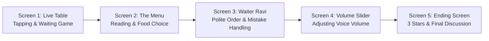
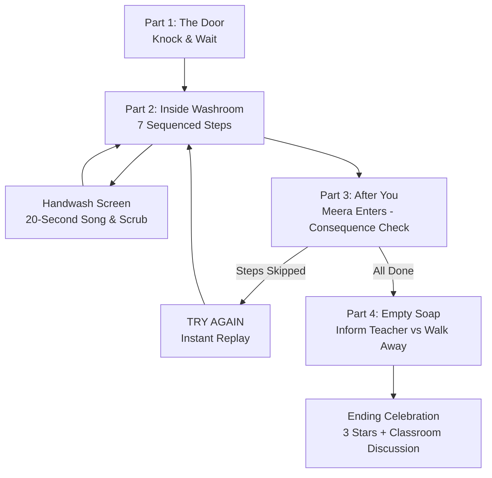
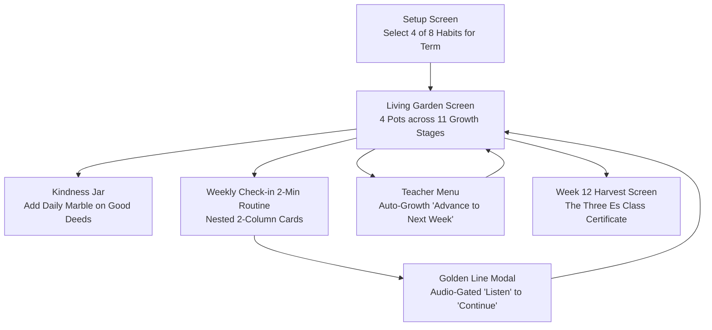

# Masters Activity — Senior Etiquette Unity Project

**Target Audience:** Class 3 & Class 4 (Ages 8–9)  
**Engine & Platform:** Unity 2022 LTS / 2023 2D (Smartboard & Touch-Screen Optimized)  
**Render Pipeline:** Universal Render Pipeline (URP 2D)  
**UI Framework:** Unity UI (Canvas Scaler: 1920x1080 Reference Resolution) + TextMeshPro  

---

## 🌟 Repository Overview

This repository contains the interactive Senior Etiquette modules designed for classroom smartboard activities and interactive tablets. The project is organized into modular units:

| Unit | Title | Core Concept | Main Scene |
| :--- | :--- | :--- | :--- |
| **Unit 6** | **Eating Out / Table Etiquette** | Patience while waiting, polite ordering, handling mistakes calmly, indoor voice modulation | `Assets/SeniorsActivityUnit6/Scenes/SeniorsActivity_unit6.unity` |
| **Unit 8** | **Washroom Etiquette ("AFTER YOU")** | Empathy & leaving shared facilities clean for the next student | `Assets/SeniorsActivityUnit8/Scenes/SeniorsActivity_unit8.unity` |
| **Unit 10** | **The Golden Garden (Golden Life)** | Continuous habit tracking, 11-stage plant growth, kindness marbles, weekly quote reflection, The Three Es certificate | `Assets/SeniorsActivityUnit10/Scenes/SeniorsActivity_unit10.unity` |

---

## 📁 Repository Directory Structure

```text
MastersActivity-Unit-6/
├── Assets/
│   ├── SeniorsActivityUnit6/                  # --- UNIT 6: RESTAURANT & TABLE ETIQUETTE ---
│   │   ├── Art/                               # UI panels, character sprites, plates, food items
│   │   ├── Audio/                             # Full suite of standardized VO and ambient audio
│   │   │   └── U6_MastersActivity_audios/     # 51 standardized clips (VO_U6_*, SFX_*, AMB_*, MUS_*)
│   │   ├── Scenes/
│   │   │   └── SeniorsActivity_unit6.unity    # Primary Unit 6 playable scene
│   │   ├── Scripts/
│   │   │   ├── Core/                          # Core Managers & Enums
│   │   │   │   ├── U6_GameManager_Masters_Activity.cs
│   │   │   │   ├── U6_AudioManager_Masters_Activity.cs
│   │   │   │   └── U6_Enums_Masters_Activity.cs
│   │   │   ├── Screens/                       # Screen Controllers for all 5 gameplay stages
│   │   │   │   ├── U6_LiveTableScreen_Masters_Activity.cs
│   │   │   │   ├── U6_MenuScreen_Masters_Activity.cs
│   │   │   │   ├── U6_WaiterInteractionScreen_Masters_Activity.cs
│   │   │   │   ├── U6_SliderScreen_Masters_Activity.cs
│   │   │   │   └── U6_EndingScreen_Masters_Activity.cs
│   │   │   ├── UI/                            # Reusable UI widgets & animations
│   │   │   └── Editor/                        # Scene generation and auto-wiring tools
│   │   └── SFX/                               # Procedural audio generator & sound assets
│   │
│   ├── SeniorsActivityUnit8/                  # --- UNIT 8: WASHROOM ETIQUETTE ("AFTER YOU") ---
│   │   ├── Art/                               # 9-slice boxes, character poses (Anu & Meera), props, germs
│   │   ├── Audio/                             # Unit 8 Voiceover clips
│   │   ├── doc/                               # Design specifications, audio manifests, context
│   │   ├── README.md                          # Dedicated Unit 8 documentation
│   │   ├── Scenes/
│   │   │   └── SeniorsActivity_unit8.unity    # Primary Unit 8 playable scene
│   │   ├── Scripts/
│   │   │   ├── Core/                          # U8_GameManager, U8_AudioManager
│   │   │   ├── Screens/                       # 6 Screen Controllers (Door, Inside, Handwash, AfterYou, EmptySoap, Ending)
│   │   │   └── Editor/                        # U8_SceneSetupTool for 1-click scene generation
│   │   └── SFX/                               # 24 procedural 16-bit PCM sound effects generator
│   │
│   ├── SeniorsActivityUnit10/                 # --- UNIT 10: THE GOLDEN GARDEN (GOLDEN LIFE) ---
│   │   ├── Art/                               # 88 botanical plant sprites, 9-slice carved boards/cards, terracotta pot, glass jar
│   │   ├── Audio/ & Audio voices/ & SFX/      # 25 Neural TTS voiceovers, seamless ambient & BGM loops, smooth SFX
│   │   ├── doc/                               # Design specifications and audio manifests
│   │   ├── README.md                          # Dedicated Unit 10 documentation
│   │   ├── CONTEXT.md                         # Unit 10 architecture and asset context
│   │   ├── Unit_10_Specification.md           # 12-week progression and pedagogical specification
│   │   ├── Audio_Manifest_Unit_10.md          # Complete Unit 10 audio manifest
│   │   ├── Scenes/
│   │   │   └── SeniorsActivity_unit10.unity   # Primary Unit 10 playable scene
│   │   ├── Scripts/
│   │   │   ├── Core/                          # U10_GameManager, U10_AudioManager, U10_SaveData
│   │   │   ├── Screens/                       # SetupScreen, GardenScreen, WeeklyCheckScreen, GoldenLineModal, EndTermScreen
│   │   │   ├── UI/                            # U10_PlantDisplayUI (dual badges), U10_ButtonAttentionPulse
│   │   │   └── Editor/                        # U10_SceneSetupTool (generators, non-destructive skinners, pot label fixer)
│   │   └── SFX/                               # Procedural audio synthesis scripts
│   │
│   ├── TextMesh Pro/                          # Fonts, essential resources, and SDF shaders
│   └── Settings/                              # URP Graphics & quality configuration
├── .agents/skills/unit10-golden-garden/       # Unit 10 agent skill and workflow guidelines
└── ProjectSettings/                           # Unity project settings (Tags, Layers, Audio, Input)
```

---

## 🍽️ Unit 6: Eating Out — Architecture & Screen Flow

### Gameplay Progression



### Screen Breakdown

1. **Screen 1 — Live Table (`U6_LiveTableScreen_Masters_Activity.cs`)**:
   - **Concept:** Anu waits for food. Impatience causes her to tap cutlery or fidget.
   - **Mechanic:** Tap-the-button mini-game rewards patience with **Star 1**.
   - **Audio:** `AMB_Restaurant`, `SFX_GlassTing`, `SFX_ChairWobble`, `VO_U6_01` to `VO_U6_04`.

2. **Screen 2 — Menu Screen (`U6_MenuScreen_Masters_Activity.cs`)**:
   - **Concept:** Reading before ordering and choosing a meal.
   - **Mechanic:** Laminated menu interaction, option selection.
   - **Audio:** `SFX_MenuOpen`, `VO_U6_05`, `VO_U6_06`.

3. **Screen 3 — Waiter Interaction (`U6_WaiterInteractionScreen_Masters_Activity.cs`)**:
   - **Concept:** Ordering politely and handling when the wrong dish arrives.
   - **Mechanic:** Branching dialogue choices (Polite vs Impatient / Rude).
   - **Consequence:** Calm response triggers Waiter Ravi's warm apology (`VO_U6_WAIT_3`) and **Star 2** award.
   - **Audio:** `VO_U6_08`, `VO_U6_09`, `VO_U6_ANU_1` through `VO_U6_ANU_7`, `VO_U6_WAIT_1` through `VO_U6_WAIT_4`, `AMB_RestaurantHush`.

4. **Screen 4 — Voice Volume Slider (`U6_SliderScreen_Masters_Activity.cs`)**:
   - **Concept:** Understanding restaurant ambient noise vs appropriate indoor speaking volume.
   - **Mechanic:** Interactive 3-zone slider (Too Quiet $\rightarrow$ Just Right $\rightarrow$ Too Loud).
   - **Consequences:** Too quiet triggers Dad's confusion (`VO_U6_DAD_1`), too loud triggers Mum's gentle warning (`VO_U6_MUM_1`), just right awards **Star 3**.

5. **Screen 5 — Ending Celebration (`U6_EndingScreen_Masters_Activity.cs`)**:
   - **Concept:** Victory fanfare, confetti, and teacher discussion prompt: *"What will you say to the waiter next time?"*.
   - **Audio:** `MUS_Win`, `SFX_Confetti`, `SFX_Clap`, `VO_U6_12`, `VO_U6_13`.

---

## 🧼 Unit 8: Washroom Etiquette — Architecture & Screen Flow

### "After You" Empathy Model



---

## 🌻 Unit 10: The Golden Garden — Architecture & Continuous Flow

### Living Classroom Routine Flow



### Screen Breakdown
1. **Setup Screen (`U10_SetupScreen_Masters_Activity.cs`)**: Select 4 of 8 core etiquette habits at the beginning of the term with game-like leaf-trimmed cards (`sub board 7`) and warm parchment selection summary (`sub board 8`).
2. **Garden Screen (`U10_GardenScreen_Masters_Activity.cs`)**:
   - **4 Terracotta Pots**: Leaf-first botanical plants evolving smoothly across **11 growth stages** (Sprout $\to$ Leaves $\to$ Bushy Foliage $\to$ Buds $\to$ Golden Bloom).
   - **Dual Pot Badges**:
     - **Top (`HabitBadge`)**: Displays habit title (e.g. *Drink Water*, *Sleep Early*).
     - **Bottom (`StageBadge`)**: Displays live developmental stage (*Stage X of 11* $\to$ *Golden Bloom*).
   - **Kindness Jar**: Right-hand interactive mason jar tracking good deeds (0 to 50+ marbles).
   - **Teacher Menu Auto-Growth**: Clicking **"Advance to Next Week"** automatically assumes all students completed all 4 habits, increments growth stage (+1 up to 11), increments check-in counts, awards +3 kindness marbles, and animates immediate plant growth.
3. **Weekly Check Screen (`U10_WeeklyCheckScreen_Masters_Activity.cs`)**:
   - **Two-Column Card Structure**: Left `PlantSubCard` (mint-cream botanical card) + Right `ContentSubCard` (warm ivory paper card with golden corner filigree).
   - High-contrast charcoal text (`#1f242e`) for high readability on smartboards and tablets.
4. **Golden Line Modal (`U10_GoldenLineModal_Masters_Activity.cs`)**:
   - Displays 12 weekly rotating positive quotes.
   - **Audio-Gated Listening Routine**: Action button reads **`Listen`** in disabled state while narrator audio plays, springing to **`Continue`** with pop-in attention animation once finished.
5. **End of Term Harvest Screen (`U10_EndTermScreen_Masters_Activity.cs`)**:
   - Week 12 Harvest Celebration honoring **The Three Es: Energy, Empathy, and Excellence**.
   - Custom class name support (`customClassName`) for customized printable certificate.

---

## 🔊 Audio System & Standardized Naming Convention

All audio assets in the project use strict naming IDs matching the curriculum design specification.

### Unit 6 Audio Manifest
- **Narrator:** `VO_U6_01` to `VO_U6_13`
- **Anu (Child):** `VO_U6_ANU_1` to `VO_U6_ANU_10`
- **Waiter (Ravi):** `VO_U6_WAIT_1` to `VO_U6_WAIT_4`
- **Parents:** `VO_U6_DAD_1`, `VO_U6_MUM_1`
- **Ambience & Music:** `AMB_Restaurant`, `AMB_RestaurantHush`, `MUS_Restaurant` (alias `MUS_Loop`), `MUS_Win`
- **Sound Effects:** `SFX_MenuOpen`, `SFX_PlateDown`, `SFX_ForkDrop`, `SFX_GlassTing`, `SFX_ChairWobble`, `SFX_BabyCry`, `SFX_DoorChime` (alias `SFX_DoorBell`), `SFX_Bubble` (alias `SFX_SliderZone`), `SFX_PadWrite`, `SFX_Sparkle`, `SFX_Star`, `SFX_Confetti`, `SFX_Clap`, `SFX_Chirp`

### Unit 10 Audio Manifest
- **Narrator (NeerjaNeural):** `VO_U10_01` to `VO_U10_12`, `VO_U10_13_01` to `VO_U10_13_12` (12 Weekly Quotes), `VO_U10_14` (Harvest)
- **Ambience & Music:** `AMB_Garden` (16.0s seamless warm harmonic pad), `MUS_Garden` (16.0s seamless C Major Rhodes/Strings), `MUS_EndTerm` (6.0s celebratory fanfare)
- **Sound Effects:** `SFX_PlantGrow`, `SFX_Flower`, `SFX_Marble`, `SFX_JarFull`, `SFX_GoldenLine`, `SFX_Tally`, `SFX_Tap` (all with smooth raised-cosine attacks $\ge 45\text{ms}$)

### Audio Manager Implementation
`U6_AudioManager`, `U8_AudioManager`, and `U10_AudioManager` provide:
- **Zero-Drop 2D Playback:** `spatialBlend = 0f` ensures uniform audio on any stereo speaker or smartboard without 3D attenuation.
- **Dedicated Audio Channels:** Separate `AudioSource` channels for BGM, Ambience, Voiceover, and SFX to allow distinct volume ducking and mixing.
- **On-Demand Editor Asset Loading:** Falls back dynamically to find audio clips by exact ID or legacy aliases.

---

## 🛠️ Developer Setup & Workflow

### 1. Requirements
- **Unity Version:** 2022.3 LTS or higher.
- **Packages Required:** TextMeshPro (`com.unity.textmeshpro`), Universal RP (`com.unity.render-pipelines.universal`).

### 2. Opening & Running the Project
1. Open the project folder in **Unity Hub**.
2. To test **Unit 6**: Open `Assets/SeniorsActivityUnit6/Scenes/SeniorsActivity_unit6.unity` and press **Play**.
3. To test **Unit 8**: Open `Assets/SeniorsActivityUnit8/Scenes/SeniorsActivity_unit8.unity` and press **Play**.
4. To test **Unit 10**: Open `Assets/SeniorsActivityUnit10/Scenes/SeniorsActivity_unit10.unity` and press **Play**.

### 3. Editor Menu Automation Tools
All units feature top-level Unity Editor menu automation under **`Googolplex`**:

#### Unit 8 Editor Tools (`Googolplex > Unit 8`)
- **`Setup Complete Unit 8 Scene`**: Rebuilds the entire 6-screen UI hierarchy, card layouts, mobile typography (32–38pt), and wire bindings.
- **`Setup Screen 2 Only (Part 2 Inside)`**: Rebuilds Screen 2 without touching other screens.
- **`Setup Screen 3 Only (Handwash Video & Song)`**: Rebuilds Screen 3 with the 8-germ layout and video player setup.
- **`Setup Screen 4 Only (Part 3 After You)`**: Updates Screen 4 with consequence visuals and Meera slip handling.
- **`Setup Screen 6 Only (Ending & Stars)`**: Updates Screen 6 with star sprites from sprite sheet.
- **`Wire Sprites & Audio Only (Non-Destructive)`**: Automatically links serialized sprite and audio references without moving or altering scene objects.
- **`Clean Duplicate UI Buttons`**: Cleans up any loose duplicate choice buttons in the hierarchy.
- **`Sanitize All UI Text Glyphs`**: Cleans all TextMeshPro labels in the scene, replacing unsupported unicode characters with clean ASCII/standard characters.

#### Unit 10 Editor Tools (`Googolplex > Unit 10`)
- **`Generate Complete Scene Hierarchy`**: Full automatic scene generator configuring all sprites (single, sliced), audio clips, screens, and wire connections.
- **`Non-Destructive > Apply Game-Like Card and Plaque Sprites`**: Skins all title plaques, containers, sub-cards, and footer bars with 9-sliced storybook assets from `U10 borad card Bg sprites.png`, setting safe padding margins to prevent text distortion or leaf clipping.
- **`Non-Destructive > Fix Pot Labels and Badges`**: Formats the dual pot labels (`HabitBadge` = Habit Title, `StageBadge` = `Stage 1 of 11`).
- **`Non-Destructive > Skin All Buttons In Active Scene`**: Applies kid-friendly 3D pill button sprites and attention pulses.
- **`Non-Destructive > Assign All Inspector Fields In Active Scene`**: Non-destructively wires all serialized references to `[GameManager]` and `U10_AudioManager`.

---

## 📐 Best Practices & Coding Standards

1. **Normal Text over Special Unicode:** Keep TextMeshPro strings to standard alphanumeric and punctuation characters to prevent missing font glyph square boxes (`\u25A1`). Never use emojis or `<` / `>` angle brackets in UI labels.
2. **2D Audio Guarantees:** Always assign `AudioSource.spatialBlend = 0.0f` to prevent distance attenuation in 2D educational apps.
3. **Responsive UI Anchoring:** Use `CanvasScaler` in `Scale With Screen Size` (1920x1080, Match Width/Height = 0.5) so that all panels render crisply across laptops, iPads, tablets, and interactive smartboards.
4. **Non-Destructive Scene Polish**: Always prefer non-destructive editor tools when updating UI sprites or labels to preserve teacher camera setups and manual inspector tweaks.
